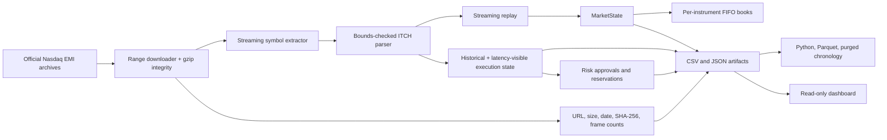

# Architecture

`download_real_itch.py` is the only component that contacts an external host.
The C++ engine itself opens local BinaryFILE inputs only. Raw archives,
extracted segments, and generated runs remain outside source control.

`NasdaqItchParser` owns framing, exact known-type validation,
strict/permissive unknown handling, statistics, and callback delivery.
`MarketState` routes each active order ID to one stock locate. An `OrderBook`
owns price levels, FIFO queues, and iterator locators; mutations validate
preconditions before changing state.

Replay consumes parser callbacks without retaining the full input. Each
execution policy rebuilds independent historical and latency-delayed visible
state. Simulated aggressive consumption lives in a separate shadow ledger so
one displayed unit cannot fill multiple children. Parent, child, queue, fill,
risk, and decision ledgers become immutable artifacts consumed by research and
the dashboard.

The provenance checksum is repeated in replay metadata, execution context, and
research metadata. The real-data research runner refuses mismatched artifacts.
