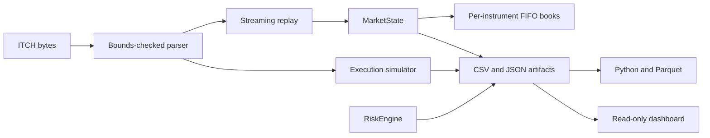

# Architecture

`NasdaqItchParser` owns structural framing, exact known-type validation, strict/permissive unknown handling, statistics, and callback delivery. `MarketState` routes every active order ID globally to exactly one stock locate; an `OrderBook` owns price levels, FIFO queues, and iterator locators. Mutations validate all preconditions before they change state.

Replay consumes parser callbacks and does not retain the full file. Every execution strategy rebuilds a fresh historical state, so no strategy can mutate another. Generated CSV, JSON, and Parquet artifacts are the only interface to the dashboard and research code. No component opens a network connection or submits an order.
